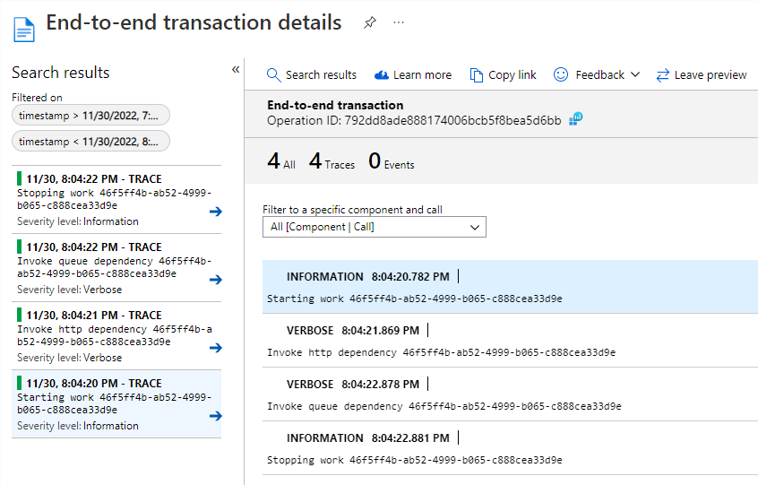

[](https://github.com/aimenux/AzureAppInsightsConsoleDemo/actions/workflows/ci.yml)

# AzureAppInsightsConsoleDemo
```
Logging into Azure Application Insights within console applications
```

In this repo, i m logging into azure application insights within console application using serilog.
>
> - Each run generate a couple of logs attached to the same operation ([see docs](https://learn.microsoft.com/en-us/azure/azure-monitor/app/custom-operations-tracking))
>
> - Each log is enriched with custom properties ([scope logging](https://learn.microsoft.com/en-us/aspnet/core/fundamentals/logging/?view=aspnetcore-7.0#log-scopes))
>
> 

>

**`Tools`** : vs22, net 6.0, application-insights, serilog